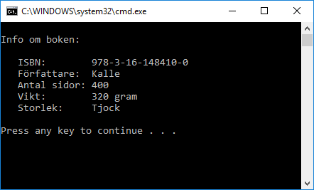

# Böcker 1

Skapa en klass **Book**. Detta ska kunna sparas för varje bok:

- Författare
- ISBN-nummer
- Antal sidor

Skapa metoder för att sätta och hämta dessa värden. 

Här är ett exempel när bok-klassen används:

    public void Run()
    {

        var b1 = new Book();

        b1.SetIsbn("978-3-16-148410-0");
        b1.SetAuthor("Kalle");
        b1.SetNrOfPages(400);

        Console.WriteLine($"Info om boken:");
        Console.WriteLine();
        Console.WriteLine($"   ISBN:        {b1.GetIsbn()}");
        Console.WriteLine($"   Författare:  {b1.GetAuthor()}");
        Console.WriteLine($"   Antal sidor: {b1.GetNrOfPages()}");
        Console.WriteLine($"   Vikt:        {b1.WeightInGram()} gram");
        Console.WriteLine($"   Storlek:     {b1.Size()}");
        Console.WriteLine();
    }

Det ska ge detta resultat:

Vikten ska räknas ut genom att ta antal sidor gånger 0.8

Storlek är antingen "Tunn" (färre än 100 sidor), "Normal" (mellan 100 och 299) eller "Tjock" (över 300).

En får högst vara 1000 sídor lång. Om ett felaktigt värde försöker sättas så sätt bokens storlek till 300.