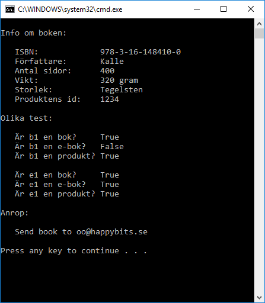

# Böcker 2

Fortsätt på bok-appen.

Skapa en **Product**-klass. Skapa en **ElectronicBook**-klass. 

Både **Book** och **ElectronicBook** är produkter. **ElectronicBook** är en sorts bok. Använd arv (inheritance).

Tips: för att säga att en katt är ett djur, alltså ärver från klassen djur så skrivs:

    class Cat : Animal
    {
    }

Alla produkter har ett **id** som kan sättas och hämtas genom metoder:

    GetProductId
    SetProductId

En elektronisk bok har en metod

    SendBookTo(string emailAdress)

...som skickar boken till en viss epostadress. För att slippa skriva koden för detta så räcker det att du skriver ut t.ex "Skickar boken till .....";

Skapa en bok som även har ett produkt id. Skapa en e-bok. Göra olika tester. I slutet så anropa "SendBookTo". Exempel när programmet körs:

## Tips

För att kolla om ett objekt är av en viss typ, använd **is**. T.ex om du vill kolla om **myAnimal** är en katt:

    bool isCat = myAnimal is Cat

