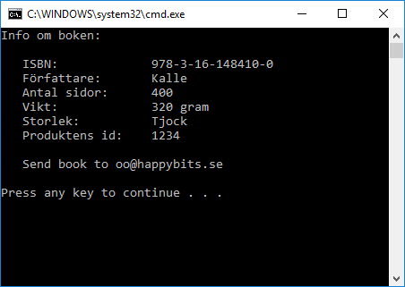

# Böcker 3

Lägg till en konstruktor till bok-klassen så användaren av klassen måste ange ISBN-nummer och titel för att skapa en ny bok.

Använd **properties** för att förenkla sättet att hämta och sätta värden.

Om din kod anropas på detta sätt:

    var b1 = new Book("XXXXXX", "Min bok");

    b1.Isbn = "978-3-16-148410-0";
    b1.Author = "Kalle";
    b1.NrOfPages = 400;
    b1.ProductId = 1234;

    Console.WriteLine($"Info om boken:");
    Console.WriteLine();
    Console.WriteLine($"   ISBN:             {b1.Isbn}");
    Console.WriteLine($"   Författare:       {b1.Author}");
    Console.WriteLine($"   Antal sidor:      {b1.NrOfPages}");
    Console.WriteLine($"   Vikt:             {b1.WeightInGram} gram");
    Console.WriteLine($"   Storlek:          {b1.Size}");
    Console.WriteLine($"   Produktens id:    {b1.ProductId}");

    Console.WriteLine();

    var e1 = new ElectronicBook("978-9-17-639279-9", "Röda rummet");
    e1.SendBookTo("oo@happybits.se");

... så ska följande skrivas ut:

