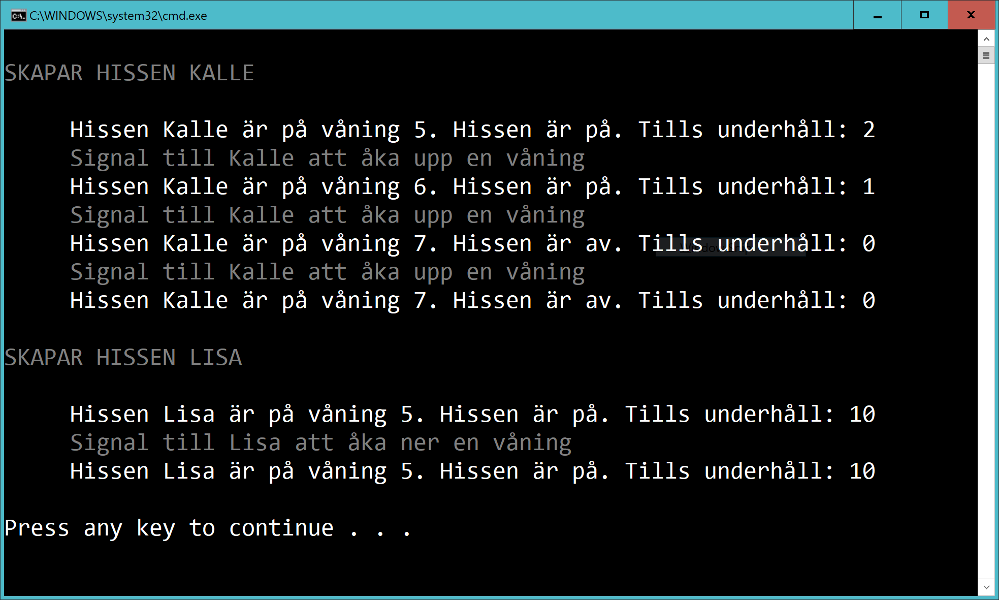

# Hissapp - intro

Skapa en klass **Elevator**. Det ska gå att ange
- namn
- lägsta våning
- högsta våning
- startvåning
- tid till underhåll
- om hissen är igång eller ej (hissen stängs av när tid till underhåll är 0)

Metoden **GoUp** ska skicka upp hissen och metoden **GoDown** ska skicka upp hissen

**Report** ska ge info om hissen.

Om denna kod körs:

        // Test av Kalle

        Header("SKAPAR HISSEN KALLE");
        var e1 = new Elevator("Kalle", -2, 10, 5, 2);
        Console.WriteLine("     " + e1.Report());
        Info("Signal till Kalle att åka upp en våning");
        e1.GoUp();
        Console.WriteLine("     " + e1.Report());

        Info("Signal till Kalle att åka upp en våning");
        e1.GoUp();
        Console.WriteLine("     " + e1.Report());

        Info("Signal till Kalle att åka upp en våning");
        e1.GoUp();
        Console.WriteLine("     " + e1.Report());

        // Test av Lisa (hissen är redan på lägsta nivå så kommer inte åka nånstans)

        Header("SKAPAR HISSEN LISA");
        var e2 = new Elevator("Lisa", 5, 8);
        Console.WriteLine("     " + e2.Report());
        Info("Signal till Lisa att åka ner en våning");
        e2.GoDown();
        Console.WriteLine("     " + e2.Report());

... så ska detta skrivas ut:

(Header och Info är bara två hjälpmetoder och hör inte till Elevator-klassen)

