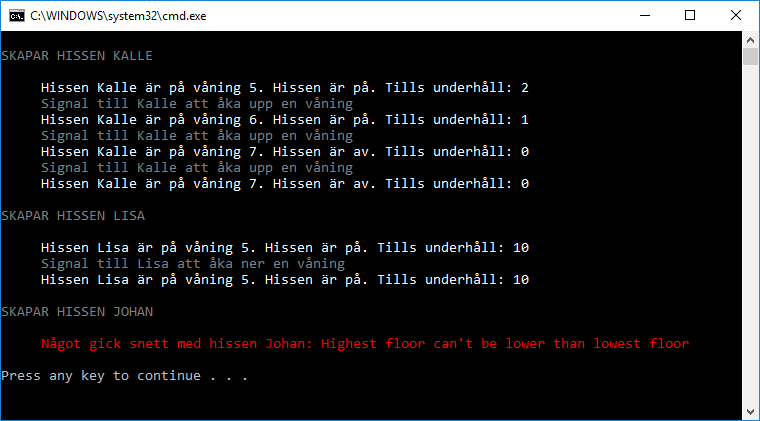

# Hissapp

## Syfte

Syftet med denna uppgift:
- lära sig modellera verkligheten med klasser
- lära sig skriva tester för att verifiera att koden funkar

## Domän

Skapa ett projekt **ElevatorApp.Domain** med en klass **Elevator**.

En hiss ska ha
- ett namn
- en lägsta våning
- en högsta våning
- hålla koll på nuvarande våning
- hålla koll på hur lång det är kvar tills hissen kräver underhåll
- veta om den kan köras eller ej (beror på om hissen behöver underhåll)

Det ska gå att skicka hissen upp och ner

Hantera fel, ge exception om hissen startar på en våning som är utanför hiss schaktet (ex våning 1000 eller -300)

## Test

Skapa ett testprojekt **ElevatorApp.Test** med en testklass i.

Skapa ett tiotal tester som verifierar att din Elevator-klass beter sig som väntat

Döp testerna enligt detta mönster:

    "Should [be in some state] [after/before/when] [action takes place]"

t.ex

    [TestMethod]
    public void elevator_should_be_at_level_2_when_it_starts_at_1_and_go_up_one_floor()
    {
    }

## Console

Skapa ett projekt **ElevatorApp.Gui** av typen Console Application. 

Skapa en Elevator. Skicka den upp och ner och rapportera vilka våningar den passerar.

Skapa en till Elevator men ge den felaktiga värden. Fånga exception och skriv felmeddelande på skärmen.

## Extra

Utöka projeten på valfritt sätt. T.ex 
- Låt användaren skapa valfritt antal hissar
- Rita ett grafiskt gränsnitt (med textgrafik) där en kan ser hissar som åker upp och ner
- Separera hiss-schakt från hissar (olika klasser)
- Lägg till personer som är på olika våningar och vill ta en hiss åt olika håll. Flera hissar, flera personer. Simulering. AI.