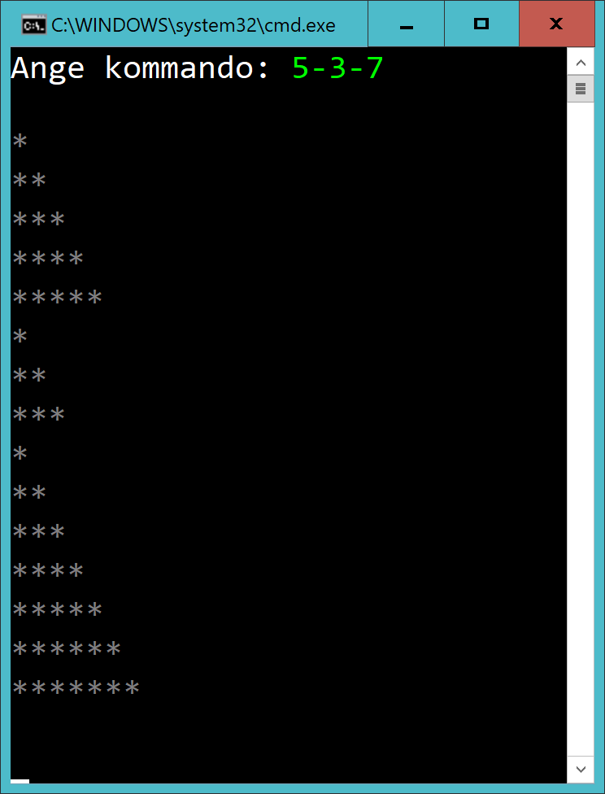
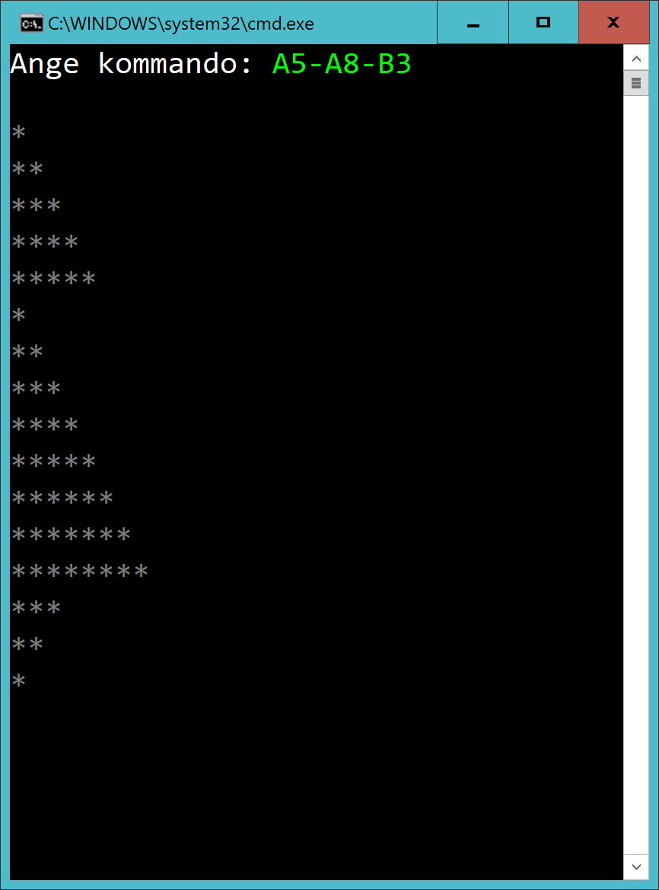

# Checkpoint 01 - Trianglar

## Tid

1.5h

## Intro

Skapa en console-app och lös antingen Nivå 1 eller Nivå 2.

Lämna bara in en version av ditt program. 

## Inlämningsinstruktioner

När du är klar, skapa en **zip** av din lösning.

Ta bort mapparna **.vs**, **bin** och **obj**.

## Nivå 1

Användaren matar in en lista av siffror separerade med streck. Rita ut trianglar mha stjärnor. Trianglarn ska ha samma bas som höjd. Trianglarna ska ritas upp under varandra.

I exemplet nedan så ritas en triangel med storlek 5 upp, sedan en triangel med storlek 3 och sist en med storlek 7:

## Nivå 2

Användaren ska kunna skapa trianglar av två sorter:

- Triangel A har en spets i toppen
- Triangel B har en spets i botten

Exempel:

- Triangeln A2 har en spets i toppen och storleken 2.
- Triangeln B4 har en spets i botten och storleken 4.

Exempelkörning:

