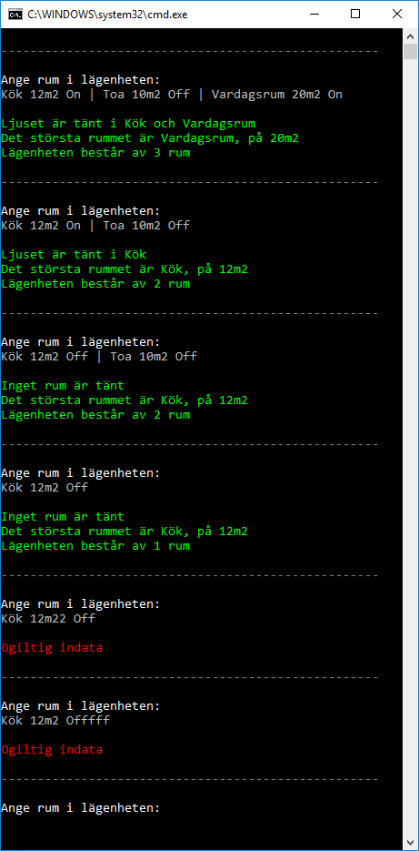

# Checkpoint02 - Rum

## Intro

Lämna bara in en version. Du kan börja direkt på nivå 2 om du vill.

## Tid 

2h

## Nivå 1

Användaren matar in rumsnamn tillsammans med storlek på rummet. Storleken anges med en siffra samt texten "m2". Se nedan.

Skriv ut rummen och skriv även ut vilket rum som är störst samt dess storlek.

Lös uppgiften genom att skapa en klass **Room** som du använder i programmet (krav)

## Nivå 2

Användaren skriver nu rum i detta format:

    Rumsnamn Kvadratmeter LjusetPåEllerEj

T.ex

    Salong 15m2 On

Ljuset i ett rum är antingen på eller av: **On** eller **Off**.

Validera användarens input. Ge meddelande om användaren matar in på fel format. Upprepa i all evighet.

När användaren matar in rätt input så skriv ut:
- Vilka rum som är tända (om något) 
- Vilket rum som är störst 
- Hur många rum som har angivits

Se nedan för hur datan ska presenteras.

