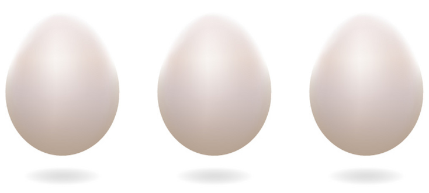
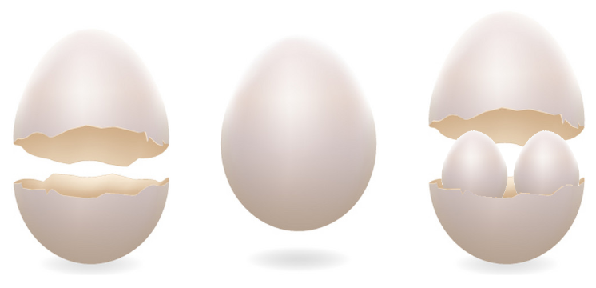
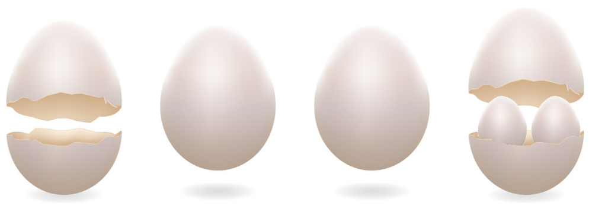

# Checkpoint - Ägg

## Intro

Du ska skriva en html-sida som visar och hanterar ägg. Använd följande tekniker:
- HTML
- CSS
- Javascript

Använd inga färdiga ramverk (t.ex Bootstrap, jQuery, React....).

Utgå ifrån dessa filer (bilder på ägg + en CSS-fil)

https://github.com/happy-bits/itch/tree/master/Checkpoints/Checkpoint7/startkit

## Nivå 1

Ägget kan ha tre tillstånd:
- stängt
- öppet
- öppet med två ägg inuti

Börja med att visa tre stängda ägg. 

När användaren klickar på ett ägg ska det öppnas. Nästa gång ägget klickas så ska det dyka upp två ägg inuti. Klickar användaren igen så sluts ägget.

I bilden nedan så har användaren tryckt 
- En gång på ägg 1
- Sex gånger på ägg 2
- Två gånger på ägg 3

## Nivå 2

Börja med att visa tre stängda ägg. 

Detta händer när användaren klickar på äggen.

- Klick på stängt ägg => ägget öppnas
- Klick på öppet ägg => ägget öppnas med två ägg inuti
- Klick på "öppet ägg med två inuti" => ägget förvinner och ersätts av två nya stängda ägg på **samma position**

I bilden nedan så har användaren tryckt 
- En gång på ägg 1
- Två gånger på ägg 3
- Tre gånger på ägg 2 (som har spruckit och blivit två nya stängda ägg)

De nya äggen kan såklart också föröka sig om användaren klickar på dem.