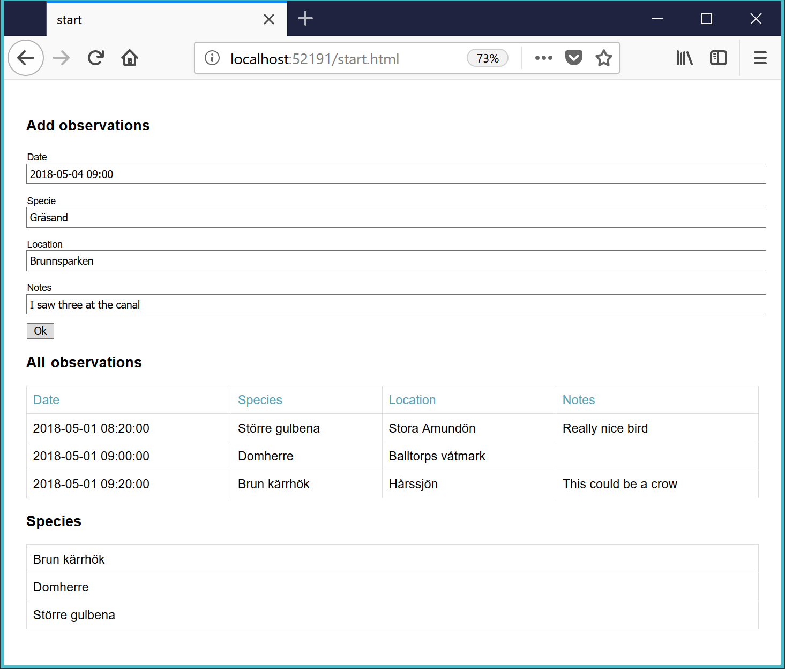

# Checkpoint - Watching birds

You're going to write a webapp for bird watching.

Write a Single Page Application (only use **one** html file). Make request using AJAX.

## Level 1

The user enters a specie and hits OK. The specie should then be saved in the database.

When the user presses the button below "Show all observations", all birds should be listed:

You don't need to do any validation of the form.

## Level 2

The user enters date, specie, location and notes and presses OK. The observation should then be stored in the database. The table should be updated right after the observations is sent to the database.

Moreover, display a list of all species. Just show one specie one time.

Sort the observations by date.

Sort the species by name.

You don't need to do any validation of the form.

