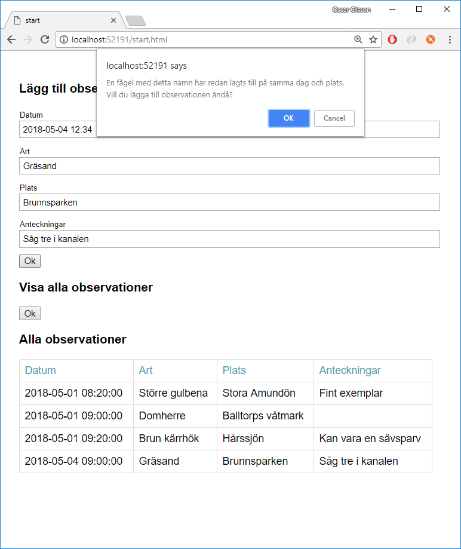

## Level 3

Bygg vidare på Level 2. 

Om användaren försöker skicka in en observation på en fågelart som redan registrerats **den dagen** på **samma plats** så ge en varning (se bilden). (Bry dig inte om vad användaren skriver i Anteckningar).

Om användaren trycker OK så lägg in observationen. Annars lägg inte in något.

Tips för att öppna en dialogruta i javascript:

    window.confirm(...)