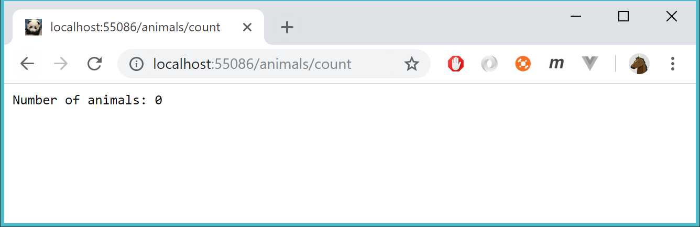
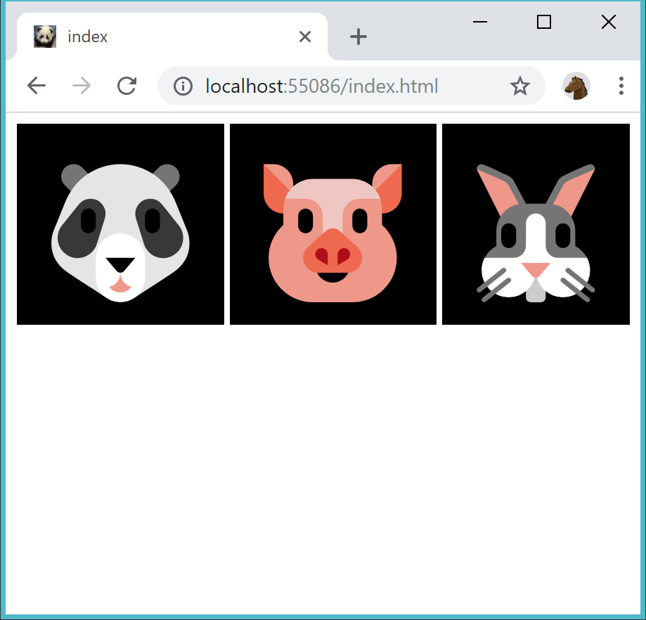
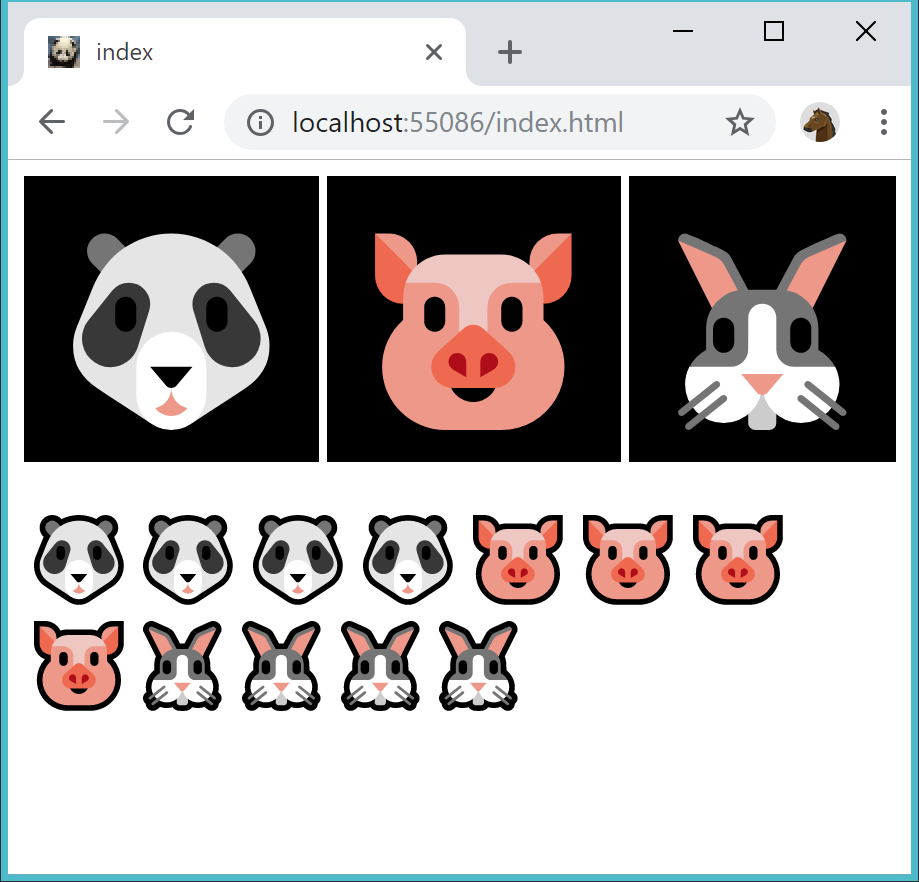

# Checkpoint - Animal farm

You're going to write a webapp for an animal farm.

Start with this project:

....

## How to submit

Fill in the document **assignement.txt** and submit in Canvas.

## Level 1

Create a site and database in **smarterasp.net** using your own account.

Publish the site and database to **smarterasp.net**

To check if the app and database is published correct, do this test:

If you browse to http://YOURSITE/animals/count this should be displayed:

## Level 2

When the user enters the site show all animals from the Animals table. (in this case there are no animals at all)

Every time the user presses on one of the top three (big) animals - add a row in the Animal table. At the same time update the GUI so all animals (from Animal table) is shown.

In the following picture the user has pressed
- "panda" four times
- "pig" four times
- "rabbit" four times

(If the another user enters the site the same animals should be shown)

Use **Vue** to solve the exercise.
 
The app and database should be published to **smarterasp.net**