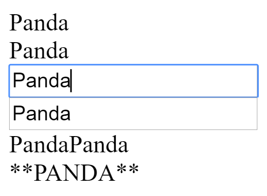

# Lab 1

Så fort användaren skriver nåt i nån av de två textfältet i mitten => uppdatera gränsnittet enligt nedan:

Rad 3 och rad 4 är en textruta

Vid rad 5 skrivs innehållet ut två gånger efter varandra.

Vid rad 6 skrivs texten med stora bokstäver och med stjärnor omkring. Om det inte matas in något i textrutan så skriv inte ut några stjärnor.