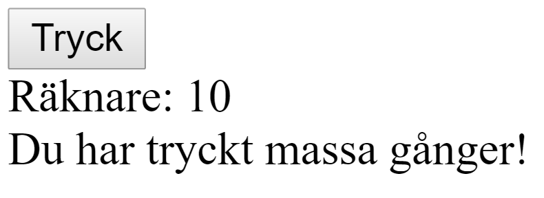
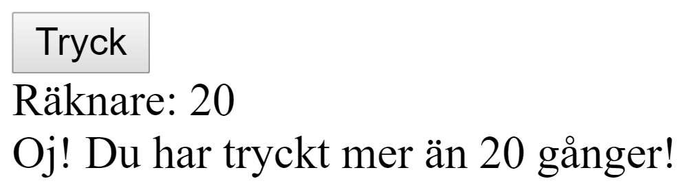

# Lab 2
En knapp och en text som håller koll på hur många gånger knappen trycks ner:

Efter att knappen tryckts ner 10 eller fler gånger:

Efter att knappen tryckts ner 20 eller fler gånger:

## Tips

Kolla på 

    

Metoder läggs in såhär

    const app = new Vue({
        el: "#app",
        data: {
            ...
        },
        methods: {
            myMethod: function() {
                ...
            }
    })