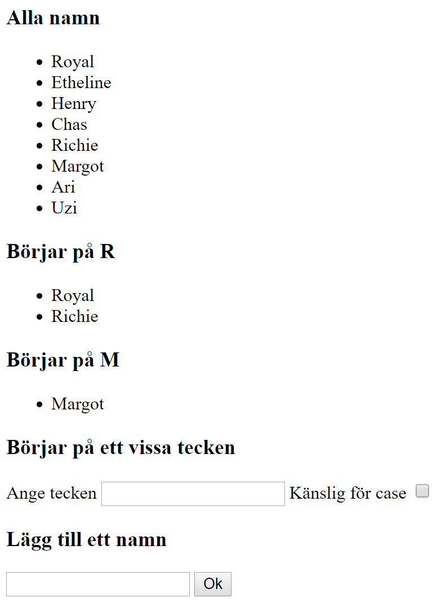

# Lab 3

Skriv ner en lista av namn.

Visa de namn som börjar på R

Visa de namn som börjar på M

Visa de namn som börjar på vissa tecken. Plus användaren kan välja att ta hänsyn till stora o små bokstäver eller ej.

Det ska även gå att lägga till namn (som uppdatera listorna automatiskt)

## Tips

Filtrera en lista i javascript:

    filter

Loopa igenom en lista och visa alla värden

    <ul>
        <li v-for="x in myList">{{x}}</li>
    </ul>