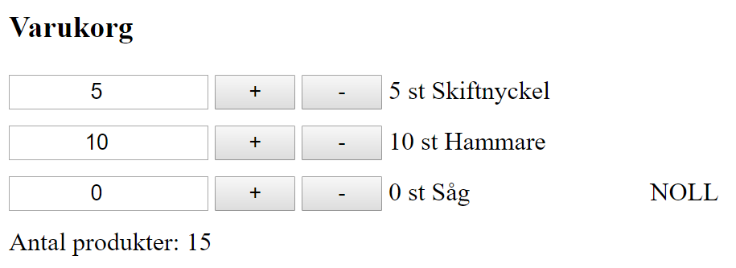

# Lab 4

Gör gränsnitt för en varukorg:

Läs inte varukorgen från ett webapi

Tryck på + => varans antal ökar med ett

Tryck på - => varans antal minskar med ett

En vara får inte ha negativt antal

Det ska gå att skriva in antal varor i textrutorna också.

Om en vara har noll antal => visa texten "NOLL".

Summera antalet varor.

## Tips

Skapa en endpoint som returnerar alla varor:

    [Route("products")]
    public class ProductController : Controller
    {
        [HttpGet]
        public IActionResult GetAll()
        {
            return Ok(new List<Product>
            {
                new Product {Name = "Skiftnyckel", Quantity = 5},
                new Product {Name = "Hammare", Quantity = 10},
                new Product {Name = "Såg", Quantity = 0}

            });
        }

    }