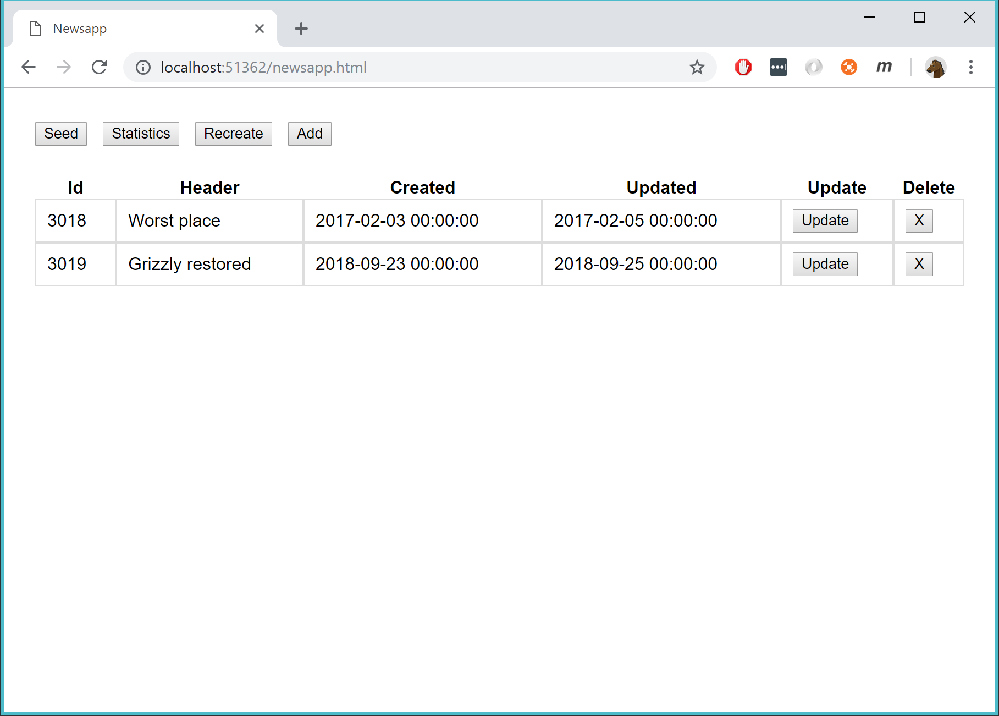
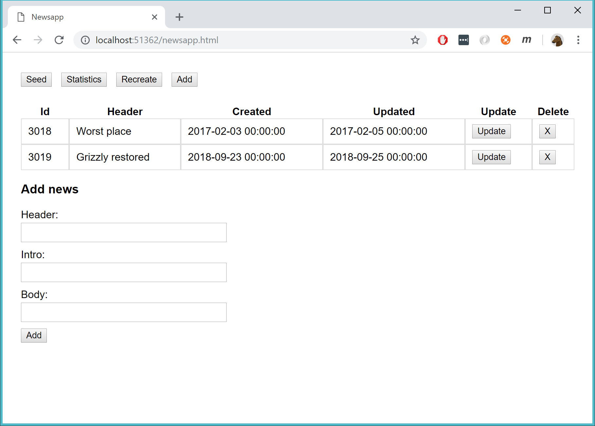
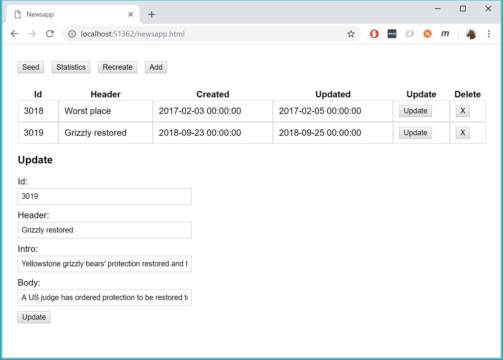

# Nyhetsapp

## Intro

Skapa en nyhetsapp. Tekniker:
- WebApi
- AJAX 
- Single Page Application 
 
Användaren är hela tiden kvar på samma html-sida.

När en nyhet skapas/ändras/tas bort så ska tabellen automatiskt uppdateras.

## Startvyn

När användaren surfar in till sajten, så visa följande gränsnitt:

Alla nyheter ska listas.

## Lägg till nyhet

Om användaren trycker **Add** så visas följande:

Klick på **Add**-knappen längst ner => uppdatera nyhetstabellen.

## Uppdatera en nyhet

Om användaren trycker **Update** så visas följande:

Klick på **Update**-knappen längst ner => uppdatera nyhetstabellen.

## Ta bort en nyhet

Om användaren trycker på  **X** så ta bort nyheten

## Statistik

Om användaren trycker på **Statistics** så visa följande vy där det går att se antalet nyheter:

## Validering

Validera nyheter

Rubrik, ingress och innehåll är obligatoriska.

Rubriken måste vara mellan 5 och 20 tecken lång.

Visa felmeddelande i form av en popup (alertruta) och informera användaren om vad som är fel.

Sätt **CreatedDate** och **UpdatedDate** till lämpliga värden när du skapar och uppdatera en nyhet.

## Seed och Recreate

Seed => ta bort alla nyheter. Skapa två nyheter (hårdkodade)

Recreate => släng bort databasen och skapa en helt ny