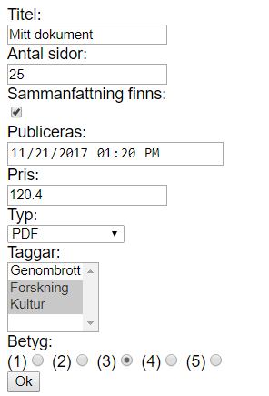
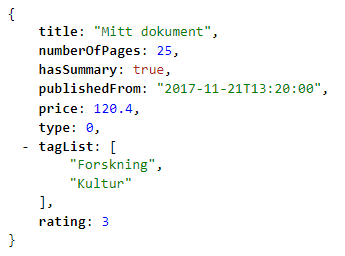

# WebApi 6 - Dokument

Skapa ett formulär där användaren kan lägga in ett dokument. 

Det ska bestå av olika formulärelement: textboxar, checkboxar, dropdowner, radiobuttons och se ut såhär:

När användaren trycker OK så skicka till en controller som returnerar all info:

## Tips

Controllern är enkel och ser ut såhär:

    [Route("webapi6")]
    public class WebApi6Controller : Controller
    {
        [HttpPost("AddDocument")]
        public IActionResult AddDocument(Document document)
        {
            return Ok(document);
        }
        
    }

Skapa klassen Document (och andra typer du behöver)