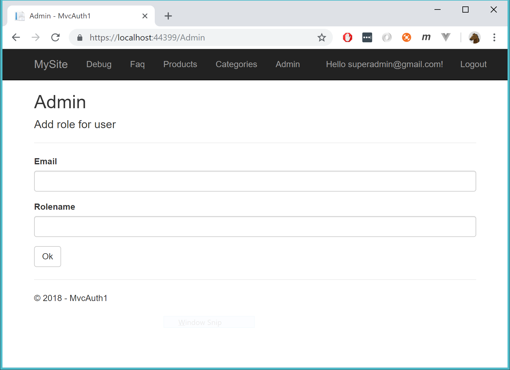
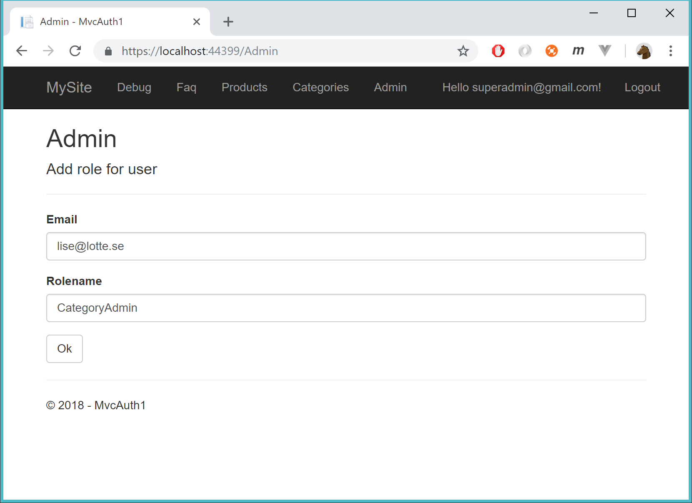
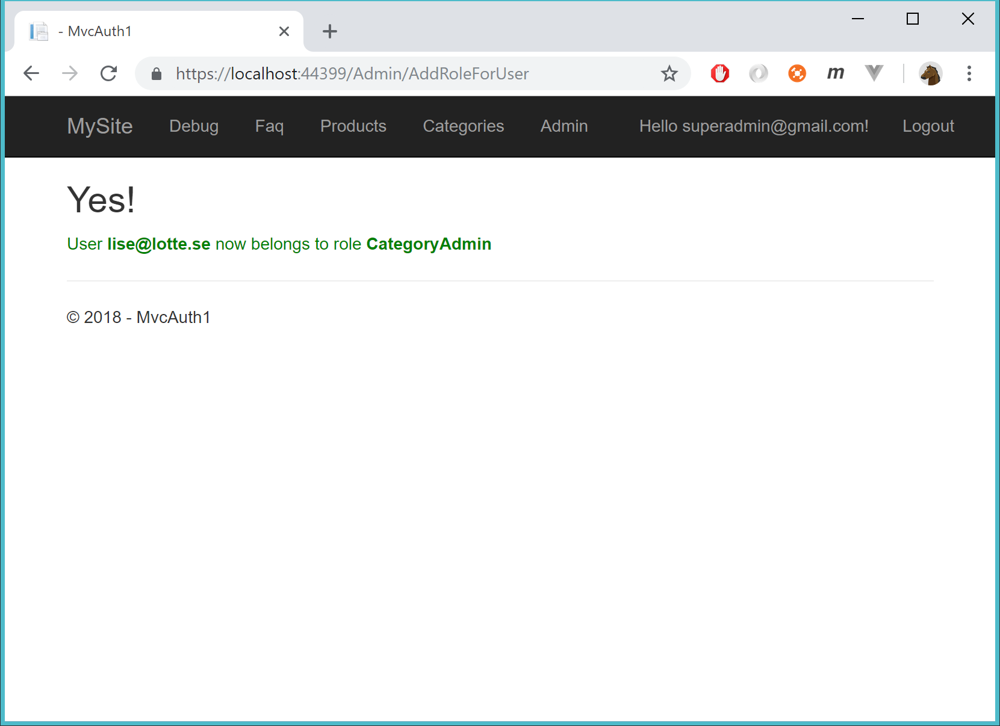
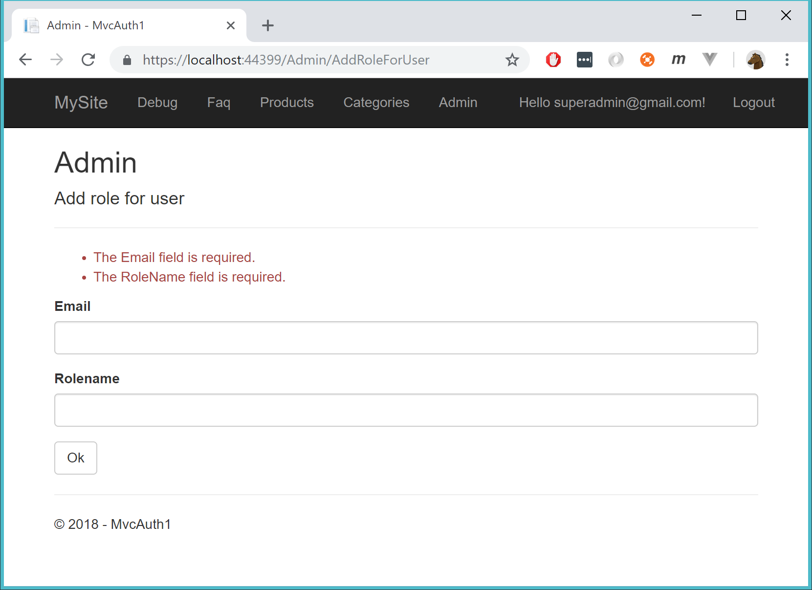
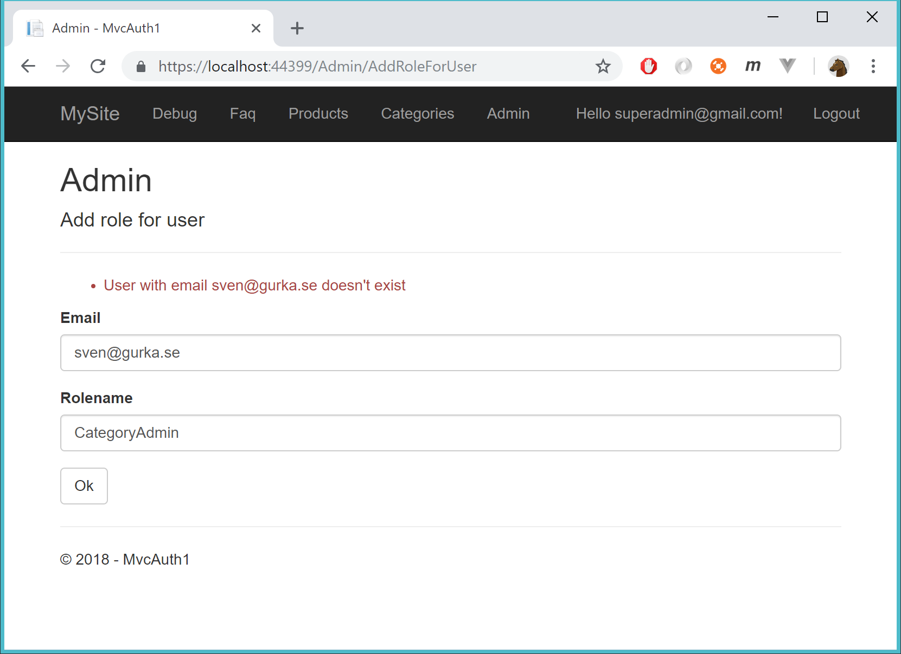
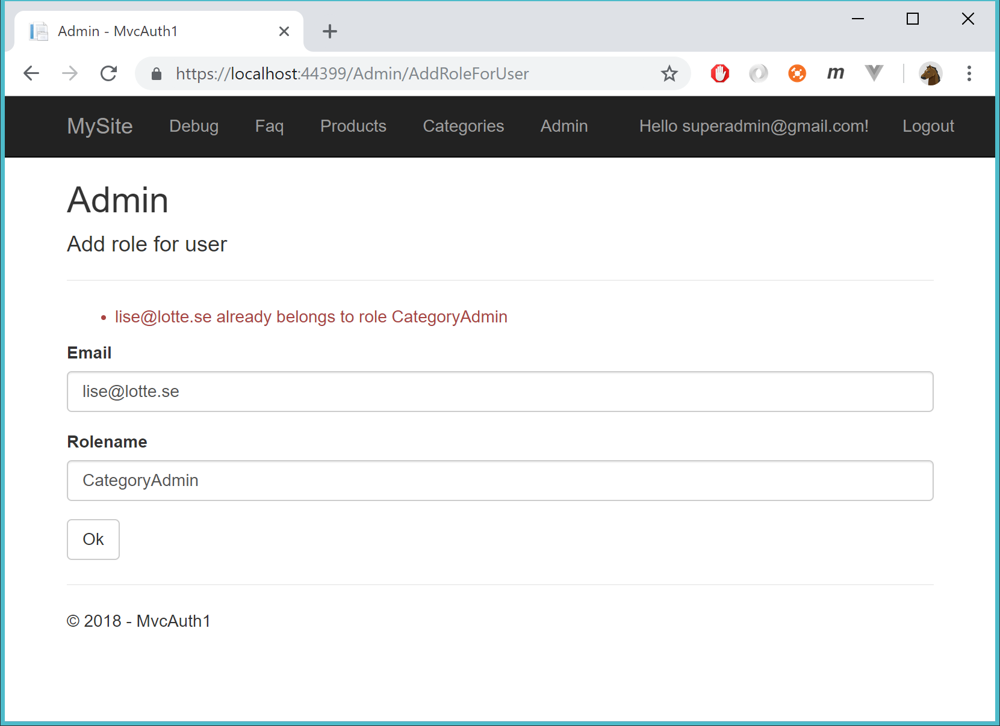

# Lägg till en roll

Startvy:

Epost matas in på känd användare + en valfri roll sätts:

När OK trycks så lägg till rollen till användaren:

## Felhantering

Validera formuläret:

Rapportera om det inte finns användare med denna epost:

Rapportera om användaren redan har denna roll:

## Behörigheter

Lägg in dessa roller för användarna:

    lise@lotte.se tillhör rollen CategoryAdmin
    dennis@bonde.se har ingen roll
    superadmin@gmail.com tillhör rollen SuperAdmin

CategoryAdmin's kan administrera kategorier

SuperAdmin's kan administrera kategorier + administera roller (i Admin-fliken)

## Tips - injection

Lägg in detta i controllern för att få tillgång till UserManager och RoleManager

    private readonly UserManager<IdentityUser> _userManager;
    private readonly RoleManager<IdentityRole> _roleManager;

    public AdminController(UserManager<IdentityUser> userManager, RoleManager<IdentityRole> roleManager)
    {
        _userManager = userManager;
        _roleManager = roleManager;
    }

I Startup.cs:

    services.AddIdentity<IdentityUser, IdentityRole>()
        .AddEntityFrameworkStores<ApplicationDbContext>()
        .AddDefaultUI()
        .AddDefaultTokenProviders();

## Tips

Kolla upp dessa metoder:

    await _userManager.FindByEmailAsync
    await _userManager.IsInRoleAsync
    await _userManager.IsInRoleAsync
    await _roleManager.CreateAsync

    ModelState

    ModelState.AddModelError

    Exceptions o try-catch
